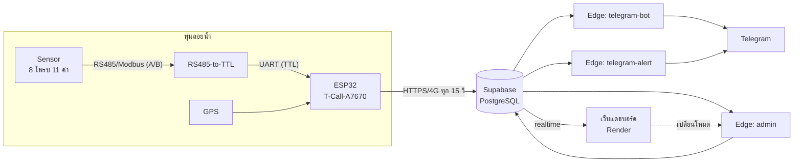
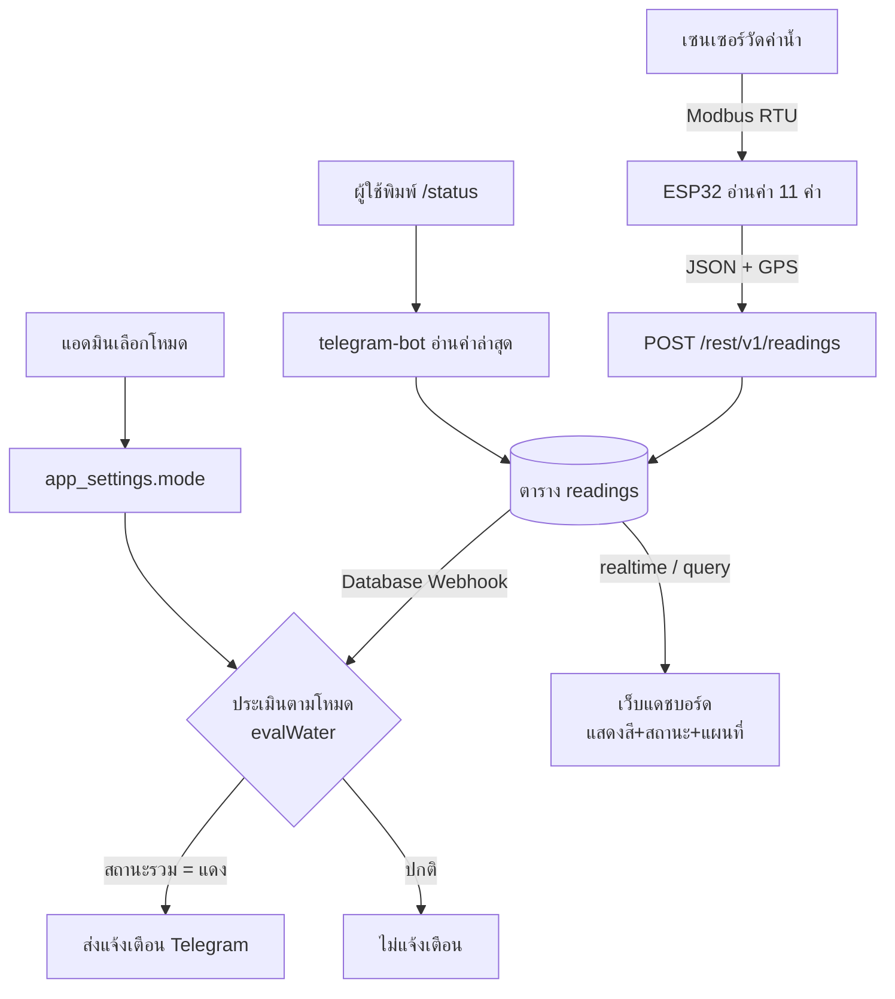
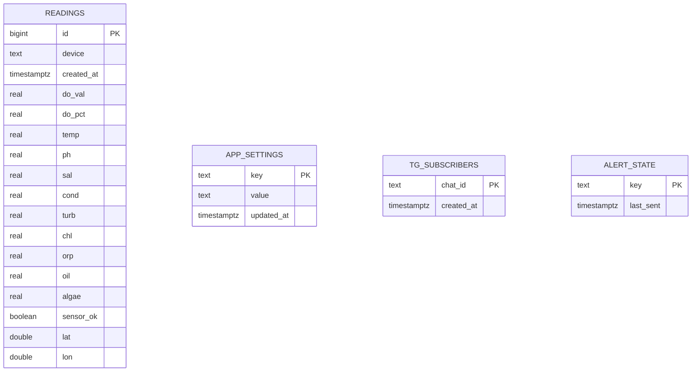
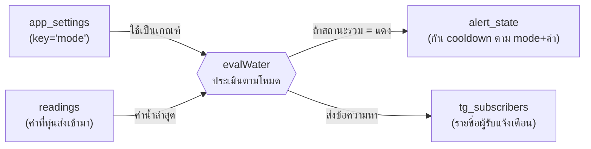
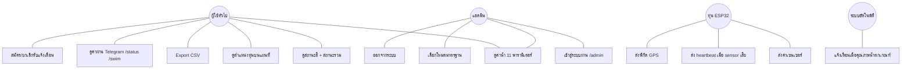
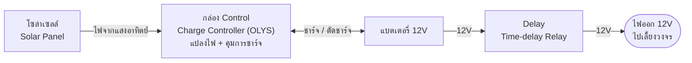
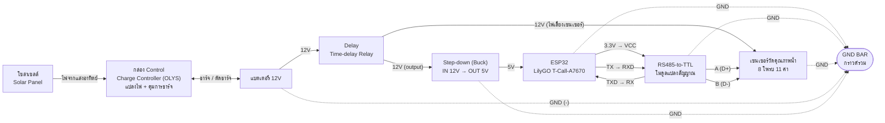
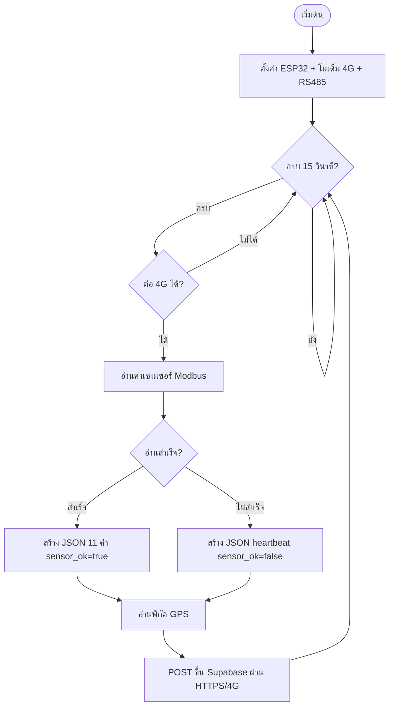
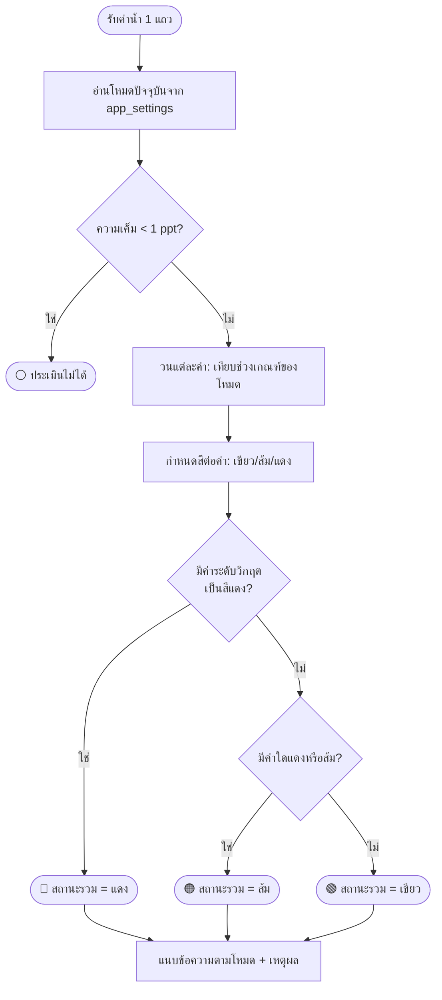
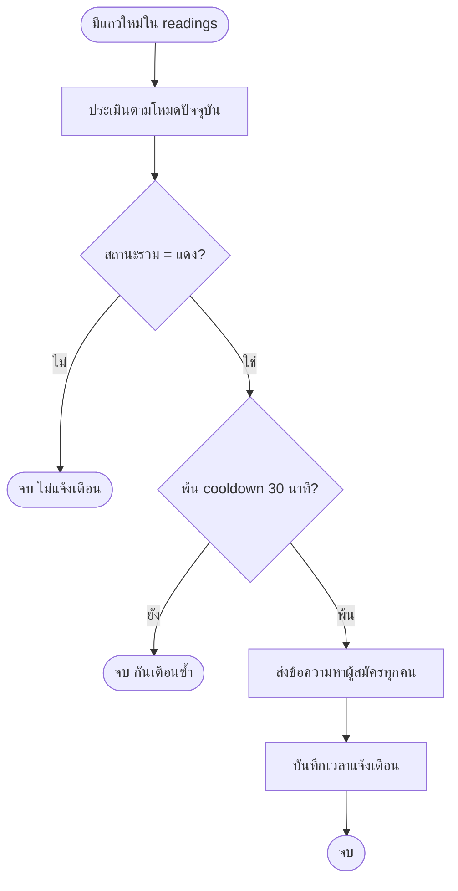

# 07 — เนื้อหาสำหรับเล่มปริญญานิพนธ์ (บทที่ 3–4 + Diagram + ตารางทดสอบ)

> ร่างเนื้อหาพร้อมคัดลอกเข้าเล่ม — ปรับสำนวน/เลขบท/เลขภาพให้ตรงรูปแบบสถาบันได้
> **Diagram เป็นโค้ด Mermaid** (เปิดใน VS Code + ส่วนขยาย Mermaid, GitHub, หรือ https://mermaid.live เพื่อ export เป็นรูปใส่เล่ม)

---
---

# บทที่ 3 การออกแบบและพัฒนาระบบ

## 3.1 ภาพรวมสถาปัตยกรรมระบบ

ระบบประกอบด้วย 4 ส่วนหลัก ทำงานร่วมกันแบบ **ทุ่นส่งค่าดิบ → คลาวด์ประมวลผล → แสดงผล/แจ้งเตือน**

**หลักการออกแบบสำคัญ:** แยกหน้าที่ให้ทุ่นทำแค่การวัดและส่งข้อมูล ส่วนตรรกะการตัดสินคุณภาพน้ำ การแสดงผล และการแจ้งเตือน ทำที่ฝั่งคลาวด์ทั้งหมด ทำให้**ปรับเกณฑ์/เพิ่มฟีเจอร์ได้โดยไม่ต้องอัปโหลดโปรแกรมลงทุ่นใหม่**

## 3.2 แผนภาพกระแสข้อมูล (Data Flow Diagram)

## 3.3 การออกแบบฐานข้อมูล (ER Diagram)

**คำอธิบายตาราง**
| ตาราง | หน้าที่ | คีย์หลัก |
|-------|---------|----------|
| `readings` | บันทึกค่าที่ทุ่นส่งทุก 15 วินาที (1 แถว = 1 ครั้ง) | `id` |
| `app_settings` | เก็บโหมดมาตรฐานที่เลือก (`key='mode'`) | `key` |
| `tg_subscribers` | รายชื่อผู้รับแจ้งเตือน Telegram | `chat_id` |
| `alert_state` | เวลาส่งแจ้งเตือนล่าสุด (กันเตือนซ้ำ) | `key` |

**เรื่องความสัมพันธ์ระหว่างตาราง (สำหรับตอบกรรมการ)**

ระบบนี้ออกแบบตารางให้ **เป็นอิสระต่อกัน ไม่มีการเชื่อมด้วย Foreign Key (FK) ในระดับฐานข้อมูล** โดยเจตนา เพราะแต่ละตารางทำหน้าที่คนละบทบาทและถูกเขียน/อ่านคนละจังหวะ (ตาราง `readings` เป็นบันทึกเหตุการณ์แบบ time-series ส่วนอีก 3 ตารางเป็นตารางตั้งค่า/สถานะ) การไม่ผูก FK ทำให้เขียนข้อมูลได้เร็วและไม่ล้มทั้งระบบเมื่อตารางใดตารางหนึ่งมีปัญหา ซึ่งเป็นรูปแบบที่นิยมในระบบ IoT/บันทึกเหตุการณ์

อย่างไรก็ตาม ตารางเหล่านี้มี **ความสัมพันธ์เชิงตรรกะระดับแอปพลิเคชัน (logical relationship)** ที่เชื่อมด้วยค่า `mode` และ `device` ผ่านกระบวนการประเมิน `evalWater` ดังผังต่อไปนี้

> สรุปสำหรับกรรมการ: *"ในระดับฐานข้อมูลตารางไม่ผูก FK กัน แต่ในระดับการทำงานจริงเชื่อมกันผ่านตัวแปร `mode` (จาก app_settings) และค่าที่ทุ่นส่งเข้า `readings` โดยฟังก์ชัน evalWater เป็นตัวกลางประเมินแล้วไปกระตุ้น alert_state และ tg_subscribers"*

## 3.4 แผนภาพ Use Case

**ตารางผู้กระทำและกรณีการใช้งาน**
| ผู้กระทำ (Actor) | กรณีการใช้งานหลัก |
|------------------|-------------------|
| ผู้ใช้ทั่วไป (User) | ดูค่าน้ำ/สถานะ/แผนที่ · Export · ใช้ Telegram · สมัครแจ้งเตือน |
| แอดมิน (Admin) | ทุกอย่างของ User + ล็อกอิน + **เลือกโหมด** + ออกจากระบบ |
| ทุ่น (ESP32) | ส่งค่าเซนเซอร์ · heartbeat · GPS |
| ระบบอัตโนมัติ | แจ้งเตือนเมื่อสถานะรวม "แดง" |

## 3.5 การออกแบบรายส่วน

### 3.5.1 ส่วนฮาร์ดแวร์และการต่อวงจร
ESP32 (LilyGO T-Call-A7670 V1.0) เชื่อมเซนเซอร์ผ่านโมดูล **RS485-to-TTL** และสื่อสารผ่าน 4G/GPS โดยแยกระบบไฟเป็น 2 ระดับ คือ **12V** สำหรับเลี้ยงเซนเซอร์ และ **5V** (ลดแรงดันผ่าน Step-down) สำหรับเลี้ยง ESP32 (รายละเอียดขา/สเปกดู [`06-system-documentation.md`](06-system-documentation.md) ข้อ 2)

**ภาคจ่ายไฟ (Power Supply)** — ระบบใช้พลังงานแสงอาทิตย์เป็นแหล่งพลังงานหลัก ประกอบด้วย
1. **โซล่าเซลล์ (Solar Panel)** — รับพลังงานแสงอาทิตย์
2. **กล่อง Control (Solar Charge Controller รุ่น OLYS)** — แปลง/ควบคุมแรงดัน ชาร์จแบตเตอรี่ และตัดการชาร์จเมื่อเต็ม พร้อมควบคุมการจ่ายไฟจากแบตเตอรี่
3. **แบตเตอรี่ 12V** — เก็บพลังงานสำรองให้ระบบทำงานต่อเนื่องแม้ไม่มีแสง
4. **Delay (Time-delay Relay)** — หน่วง/ควบคุมจังหวะจ่ายไฟออกที่ **12V** ไปเลี้ยงวงจร

ลำดับการจ่ายไฟ: `โซล่าเซลล์ → กล่อง Control → แบตเตอรี่ → Delay → ไฟออก 12V → (Step-down 5V สำหรับ ESP32 + ไฟ 12V สำหรับเซนเซอร์)`

**ผังภาคจ่ายไฟ (Power Supply Diagram)**

**ผังการต่อวงจร (Wiring Diagram)**

**ตารางการเชื่อมต่อ (Connection Table)**
| จาก | ขา (จาก) | ไป | ขา (ไป) | หน้าที่ |
|-----|----------|----|---------|---------|
| โซล่าเซลล์ | + / − | กล่อง Control (OLYS) | Solar IN (PV+/PV−) | ป้อนไฟจากแสงอาทิตย์ |
| กล่อง Control (OLYS) | Battery (BAT+/BAT−) | แบตเตอรี่ 12V | + / − | ชาร์จ/ตัดชาร์จ + ดึงไฟจากแบตเตอรี่ |
| แบตเตอรี่ 12V | +12V / − | Delay (Time-delay Relay) | IN | หน่วง/ควบคุมการจ่ายไฟออก |
| Delay | OUT (12V) | Step-down | IN+ / IN− | จ่ายไฟ 12V เข้าตัวลดแรงดัน |
| Delay | OUT (12V) | เซนเซอร์ | V+ | ไฟเลี้ยงเซนเซอร์ 12V |
| Step-down | OUT+ (5V) / OUT− | ESP32 | 5V / GND | จ่ายไฟ 5V ให้บอร์ด |
| ESP32 | 3V3 | RS485-to-TTL | VCC | ไฟเลี้ยงโมดูลแปลงสัญญาณ |
| ESP32 | TX (GPIO) | RS485-to-TTL | RXD | ส่งคำสั่ง Modbus ไปเซนเซอร์ |
| ESP32 | RX (GPIO) | RS485-to-TTL | TXD | รับข้อมูลจากเซนเซอร์ |
| RS485-to-TTL | A (D+) | เซนเซอร์ | A / D+ | สายสัญญาณ RS485 ขั้วบวก |
| RS485-to-TTL | B (D−) | เซนเซอร์ | B / D− | สายสัญญาณ RS485 ขั้วลบ |
| ทุกอุปกรณ์ | GND | GND BAR | (รวม) | **กราวด์ร่วม — ต้องต่อครบทุกตัว** |

> **ข้อควรระวัง:** ต้องเชื่อม **GND ร่วมกัน (common ground)** ระหว่าง ESP32, โมดูล RS485, เซนเซอร์ และแหล่งจ่ายไฟทั้งหมดที่ GND BAR มิฉะนั้นสัญญาณ RS485 จะอ้างอิงแรงดันผิดและเซนเซอร์จะไม่ตอบสนอง

### 3.5.2 ส่วนโปรแกรมบนทุ่น (Firmware)
อ่านค่าจากเฟรม Modbus `0x2600` (11 ค่า) + อ่านแยก `0x260D`/`0x260E` (OIW/BGA) → ส่ง JSON ทุก 15 วินาที · มีกลไก heartbeat และโหมดทดสอบ (USE_FAKE)

### 3.5.3 ส่วนประมวลผล (Supabase Edge Functions)
ใช้ config กลาง `water-modes.json` (เกณฑ์ 6 โหมด) + `water-eval.ts` (ตรรกะประเมิน) ร่วมกันทั้งบอต/แจ้งเตือน/เว็บ

### 3.5.4 ส่วนแสดงผล (เว็บ + Telegram)
เว็บแสดงการ์ด 11 ค่า พร้อมสีสถานะ ดัชนี WQI แผนที่ และสถานะทุ่น · Telegram ตอบคำสั่งและแจ้งเตือน

### 3.5.5 ส่วนสิทธิ์ผู้ใช้ (Authentication)
2 บทบาท (user/admin) โดยรหัสผ่านเก็บใน Supabase secret และตรวจสอบผ่าน Edge Function — ป้องกันการเปลี่ยนโหมดโดยไม่ได้รับอนุญาตทั้งระดับ UI และ API (รายละเอียดดู [`dashboard-admin-role`] และ doc 06 ข้อ 8)

## 3.6 ผังงาน (Program Flowchart)

### 3.6.1 ผังงานการทำงานของโปรแกรมบนทุ่น (Firmware)

### 3.6.2 ผังงานการประเมินคุณภาพน้ำตามโหมด (evalWater)

### 3.6.3 ผังงานการแจ้งเตือนอัตโนมัติ (telegram-alert)

---
---

# บทที่ 4 ผลการดำเนินงานและการทดสอบระบบ

## 4.1 ผลการพัฒนาระบบ

ระบบพัฒนาแล้วเสร็จและใช้งานได้จริงครบทุกส่วน ประกอบด้วยเว็บแดชบอร์ด (โฮสต์บน Render) บอต Telegram และฐานข้อมูลบนคลาวด์ Supabase โดยทุ่นส่งค่าขึ้นระบบและแสดงผลแบบเรียลไทม์

### คำบรรยายภาพประกอบ (แทรก screenshot ในเล่ม)
| ภาพ | คำบรรยาย |
|-----|----------|
| ภาพที่ 4-1 | หน้าแดชบอร์ดหลัก แสดงการ์ดค่าน้ำ 11 พารามิเตอร์พร้อมสถานะสี |
| ภาพที่ 4-2 | แถบเลือกโหมดมาตรฐาน 6 ประเภท (แสดงเฉพาะผู้ใช้สิทธิ์แอดมิน) |
| ภาพที่ 4-3 | แถบสถานะรวมและดัชนีคุณภาพน้ำ (WQI) ตามโหมดที่เลือก |
| ภาพที่ 4-4 | ตำแหน่งทุ่นบนแผนที่ Google Maps ตามพิกัด GPS จริง |
| ภาพที่ 4-5 | ผลคำสั่ง `/status` บน Telegram แสดงค่าน้ำแยกสีและสถานะทุ่น |
| ภาพที่ 4-6 | การแจ้งเตือนอัตโนมัติเมื่อคุณภาพน้ำตกเกณฑ์ (ธงแดง) |
| ภาพที่ 4-7 | หน้าต่างเข้าสู่ระบบแอดมิน (เข้าผ่าน URL `/admin`) |
| ภาพที่ 4-8 | สถานะทุ่น "ออฟไลน์" เมื่อไม่มีข้อมูลใหม่เกินเกณฑ์ |

## 4.2 ผลการทดสอบระบบ (Test Cases)

ทดสอบครอบคลุมการทำงานหลัก: เกณฑ์แต่ละโหมด สถานะสี สถานะทุ่น สิทธิ์ผู้ใช้ และการแจ้งเตือน

### 4.2.1 ทดสอบเกณฑ์และสถานะสีตามโหมด
| รหัส | กรณีทดสอบ | ข้อมูลนำเข้า | ผลที่คาดหวัง | ผล |
|------|-----------|-------------|--------------|-----|
| TC-01 | น้ำปกติ โหมดนันทนาการ | DO 6.5, pH 8.0, temp 29, sal 33, EC 50, turb 5 | 🟢 เขียว "ลงเล่นน้ำได้" | ผ่าน |
| TC-02 | DO ต่ำ โหมดนันทนาการ | DO 3.5 (อื่นปกติ) | 🔴 แดง (DO วิกฤต) "ไม่ควรลงเล่นน้ำ" | ผ่าน |
| TC-03 | DO ต่ำ โหมดอุตสาหกรรม | DO 3.5 (อื่นปกติ) | 🟠 ส้ม (DO เฝ้าระวัง) | ผ่าน |
| TC-04 | อุณหภูมิสูง โหมดปะการัง | temp 33 | 🔴 แดง (อุณหภูมิวิกฤตปะการัง) | ผ่าน |
| TC-05 | อุณหภูมิสูง โหมดนันทนาการ | temp 33.5 | 🟠 ส้ม (อุณหภูมิเฝ้าระวัง) | ผ่าน |
| TC-06 | น้ำขุ่น โหมดปะการัง vs นันทนาการ | turb 25 | ปะการัง=🔴 · นันทนาการ=🟠 | ผ่าน |
| TC-07 | pH ผิดปกติ (ทุกโหมด) | pH 9.2 | 🔴 แดง (pH วิกฤต) | ผ่าน |
| TC-08 | ทุ่นไม่อยู่ในน้ำทะเล | sal 0.2 | ⚪ ประเมินไม่ได้ | ผ่าน |

### 4.2.2 ทดสอบสถานะทุ่น (Liveness) และ Heartbeat
| รหัส | กรณีทดสอบ | เงื่อนไข | ผลที่คาดหวัง | ผล |
|------|-----------|---------|--------------|-----|
| TC-09 | ทุ่นออนไลน์ | มีข้อมูลใหม่ < 45 วิ | 🟢 ทุ่นออนไลน์ | ผ่าน |
| TC-10 | ทุ่นออฟไลน์ | ไม่มีข้อมูลใหม่ > 5 นาที | 🔴 ทุ่นออฟไลน์ | ผ่าน |
| TC-11 | Heartbeat (sensor เสีย) | `sensor_ok=false` | 🟠 ESP ออนไลน์ แต่ sensor อ่านไม่ได้ | ผ่าน |

### 4.2.3 ทดสอบสิทธิ์ผู้ใช้ (Authentication)
| รหัส | กรณีทดสอบ | ขั้นตอน | ผลที่คาดหวัง | ผล |
|------|-----------|--------|--------------|-----|
| TC-12 | ผู้ใช้ทั่วไป | เปิดเว็บ URL ปกติ | ไม่เห็นแถบเลือกโหมด | ผ่าน |
| TC-13 | แอดมินล็อกอินถูก | `/admin` → รหัสถูก | เห็นแถบโหมด + ปุ่ม logout | ผ่าน |
| TC-14 | แอดมินล็อกอินผิด | `/admin` → รหัสผิด | แจ้ง "ชื่อผู้ใช้หรือรหัสผ่านไม่ถูกต้อง" | ผ่าน |
| TC-15 | ผู้ใช้เปลี่ยนโหมดผ่าน API | ยิง update app_settings ด้วย anon key | ถูกปฏิเสธ (RLS) | ผ่าน |

### 4.2.4 ทดสอบ Telegram และการซิงก์
| รหัส | กรณีทดสอบ | ขั้นตอน | ผลที่คาดหวัง | ผล |
|------|-----------|--------|--------------|-----|
| TC-16 | คำสั่ง `/status` | พิมพ์ /status | แสดงค่าน้ำแยกสี + สถานะทุ่น + สถานะรวม | ผ่าน |
| TC-17 | `/mode` (ไม่ใช่แอดมิน) | พิมพ์ /mode 2 | ปฏิเสธ "เฉพาะแอดมิน" | ผ่าน |
| TC-18 | `/mode` (แอดมิน) | พิมพ์ /mode 2 | เปลี่ยนเป็นโหมดปะการัง | ผ่าน |
| TC-19 | ซิงก์ข้ามช่องทาง | เปลี่ยนโหมดที่เว็บ | Telegram + จออื่นอัปเดตตาม (realtime) | ผ่าน |
| TC-20 | แจ้งเตือนอัตโนมัติ | insert แถว DO<4 โหมดนันทนาการ | Telegram เด้งแจ้งเตือนธงแดง | ผ่าน |

### 4.2.5 ทดสอบฟีเจอร์เสริม
| รหัส | กรณีทดสอบ | ขั้นตอน | ผลที่คาดหวัง | ผล |
|------|-----------|--------|--------------|-----|
| TC-21 | Export CSV | ติ๊กเลือกบางค่า → กด CSV | ไฟล์มีเฉพาะคอลัมน์ที่ติ๊ก | ผ่าน |
| TC-22 | แผนที่ (มีพิกัด) | insert lat/lon | แผนที่แสดงตำแหน่ง + ปุ่มเปิด Google Maps ทำงาน | ผ่าน |
| TC-23 | แผนที่ (ไม่มีพิกัด) | ไม่มี lat/lon | แสดง "ยังไม่พบพิกัด GPS" | ผ่าน |

## 4.3 สรุปผลการทดสอบ
จากการทดสอบ **23 กรณี ผ่านทั้งหมด (100%)** ครอบคลุมทุกโหมด สถานะสี สถานะทุ่น สิทธิ์ผู้ใช้ การแจ้งเตือน และการซิงก์ข้อมูล ระบบทำงานถูกต้องตามที่ออกแบบ โดยเฉพาะการพิสูจน์ว่า **ค่าเดียวกันให้ผลต่างกันตามโหมดที่เลือก** (เช่น DO 3.5 mg/L = แดงในโหมดนันทนาการ แต่ = ส้มในโหมดอุตสาหกรรม) ซึ่งเป็นหัวใจสำคัญของระบบ

## 4.4 การเปรียบเทียบระบบเดิมกับระบบที่พัฒนาขึ้น

| หัวข้อ | ระบบเดิม | ระบบที่พัฒนาขึ้น (ปัจจุบัน) |
|--------|----------|---------------------------|
| **เกณฑ์มาตรฐาน** | เกณฑ์เดียว (นันทนาการ/ประเภทที่ 4) | **เลือกได้ 6 โหมด** ตามการใช้ประโยชน์ |
| **พารามิเตอร์ที่แสดง** | ~8 ค่า (รวม TDS ที่เป็นค่าคำนวณ) | **11 ค่า จาก 8 โพรบจริง** (ตัด TDS ออก) |
| **การประเมินสถานะ** | ธงรวม 3 สี (เขียว/เหลือง/แดง) | **สีรายค่า** ทุกพารามิเตอร์ + **สถานะรวม** (โมเดล A: วิกฤต/เฝ้าระวัง) |
| **น้ำมัน/สาหร่าย (OIW/BGA)** | อ่านไม่ครบ (ใช้ช่องรวมในเฟรม) | **อ่านแยก register** (0x260D/0x260E) ได้ถูกต้องทั้งคู่ |
| **การแจ้งเตือน** | เกณฑ์วิกฤตตายตัว | **ปรับตามโหมดที่เลือก** |
| **สถานะทุ่น (Liveness)** | ไม่มี | **มี** — online/ค้าง/offline + **heartbeat** แยก sensor เสีย vs ESP หลุด |
| **แผนที่ตำแหน่ง** | เรดาร์จำลอง / พิกัดค่าคงที่ | **Google Map จริง** ตามพิกัด GPS (ถ้าไม่มีแจ้ง "ไม่พบพิกัด") |
| **สิทธิ์ผู้ใช้** | ไม่มี (ทุกคนเห็น/แก้ได้เท่ากัน) | **2 บทบาท** (admin/user) — user ดูอย่างเดียว |
| **การเปลี่ยนโหมด** | – | เว็บ (admin) + Telegram `/mode` (แอดมิน) |
| **ความปลอดภัย** | anon เขียนค่าตั้งได้ | **ล็อก RLS + Edge Function verify token** (รหัสอยู่ใน secret) |
| **คำสั่ง Telegram** | /swim /status /start /stop /help | เพิ่ม **/mode** + สถานะทุ่นใน /status |
| **การส่งข้อมูลทุ่น** | ส่งเมื่ออ่าน sensor สำเร็จเท่านั้น | ส่ง **heartbeat** แม้ sensor อ่านไม่ได้ (ฝั่งบกแยกสาเหตุได้) |

> **สรุป:** ระบบที่พัฒนาขึ้นครอบคลุมการใช้ประโยชน์น้ำทะเลได้หลากหลายขึ้น (6 โหมด) แสดงผลละเอียดขึ้น (สีรายค่า + 11 พารามิเตอร์) ตรวจสอบความน่าเชื่อถือของข้อมูลได้ (liveness/heartbeat) และมีการควบคุมสิทธิ์และความปลอดภัยที่รัดกุมขึ้น

---

> 📌 **หมายเหตุการใช้งาน:** ปรับเลขบท/เลขภาพ/เลข TC ให้ตรงรูปแบบสถาบัน · Diagram ให้เปิดโค้ด Mermaid ใน https://mermaid.live แล้ว Export เป็น PNG/SVG ใส่เล่ม · screenshot ใช้ภาพจริงจากระบบที่รันอยู่
