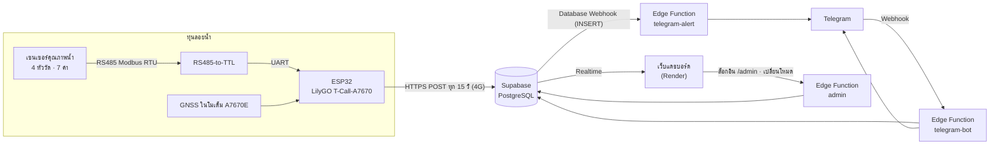

# 2. Architecture Document

## 2.1 ภาพรวมสถาปัตยกรรมระบบ



### การไหลของข้อมูล
| ขั้น | ต้นทาง → ปลายทาง | รายละเอียด |
|---|---|---|
| 1 | เซนเซอร์ → ESP32 | ESP32 ส่งคำสั่ง Modbus `01 03 26 00 00 16` อ่าน 44 ไบต์ (11 ช่อง float) ใช้ 7 ช่อง · ลองซ้ำสูงสุด 3 ครั้ง |
| 2 | ESP32 → Supabase | POST JSON ไป `/rest/v1/readings` ผ่าน HTTP application ในโมเด็ม (HTTPS + SNI) · อ่านเซนเซอร์ไม่ได้ส่ง heartbeat `sensor_ok=false` |
| 3 | Supabase → เว็บ | เว็บโหลดย้อนหลัง 120 แถว แล้วรับแถวใหม่ทาง Realtime (มี polling สำรองทุก 15 วิ) |
| 4 | Supabase → telegram-alert | ทุก INSERT เรียก Edge Function → ประเมินตามโหมด → สถานะรวมแดงจึงเตือน (cooldown 30 นาที) |
| 5 | Telegram ↔ telegram-bot | ผู้ใช้พิมพ์คำสั่ง → Telegram ส่ง webhook → ฟังก์ชันอ่านค่าล่าสุดจาก DB แล้วตอบ |
| 6 | เว็บ → admin | แอดมินล็อกอินที่ `/admin` → ได้ token → ส่งคำสั่งเปลี่ยนโหมด → ฟังก์ชันตรวจ token แล้วเขียน `app_settings` |

**หลักการออกแบบ:** ทุ่นทำหน้าที่ "อ่านค่าและส่ง" เท่านั้น ตรรกะประเมิน แสดงผล และแจ้งเตือนอยู่บนคลาวด์ทั้งหมด จึงแก้เกณฑ์หรือเพิ่มฟีเจอร์ได้โดยไม่ต้องนำทุ่นขึ้นมา flash ใหม่ และเกณฑ์ 6 โหมดอยู่ในไฟล์ config ไฟล์เดียว (`water-modes.json`) ที่ทุกส่วนอ่านร่วมกัน

### ภาคจ่ายไฟของทุ่น
```
โซล่าเซลล์ → Charge Controller (OLYS) ⇄ แบตเตอรี่ 12V → Delay (Time-delay relay) → 12V
                                                         ├─► เซนเซอร์ (12V)
                                                         └─► Step-down → 5V → ESP32
GND ของทุกอุปกรณ์ต่อร่วมที่ GND BAR
```

## 2.2 เทคโนโลยีที่ใช้และเหตุผลที่เลือก
| ชั้น | เทคโนโลยี | เหตุผลที่เลือก |
|---|---|---|
| ไมโครคอนโทรลเลอร์ | ESP32 บนบอร์ด **LilyGO T-Call-A7670 V1.0** | มีโมดูล 4G (A7670E, LTE Cat-1) และ GNSS ในบอร์ดเดียว ไม่ต้องต่อโมดูลเพิ่ม · ราคาถูก · ใช้ Arduino IDE ได้ |
| การสื่อสารกับเซนเซอร์ | RS485 / Modbus RTU ผ่านโมดูล RS485-to-TTL (auto-direction) | เป็นมาตรฐานของเซนเซอร์ · ทนสัญญาณรบกวนและสายยาว · โมดูล auto-direction ไม่ต้องคุมขา DE/RE |
| การส่งข้อมูล | 4G + HTTP application ในตัวโมเด็ม (AT+HTTP) | ใช้ได้กลางทะเลที่ไม่มี WiFi · TLS socket ของ A7670E ไม่เสถียร HTTP application ในตัวโมเด็มเชื่อถือได้กว่า |
| Firmware | Arduino (C/C++) + ไลบรารี TinyGSM | ชุมชนใหญ่ รองรับโมเด็มตระกูล A76xx |
| ฐานข้อมูล/คลาวด์ | **Supabase** (PostgreSQL + REST API อัตโนมัติ + Realtime + Edge Functions) | ได้ REST API จากตารางทันที ไม่ต้องเขียน backend เอง · Realtime ทำให้เว็บอัปเดตสด · มี RLS คุมสิทธิ์ · free tier พอสำหรับต้นแบบ |
| ตรรกะฝั่งเซิร์ฟเวอร์ | Supabase Edge Functions (Deno / TypeScript) | รันบนคลาวด์ตลอด 24 ชม. โดยไม่ต้องดูแลเซิร์ฟเวอร์ · เก็บความลับ (token/รหัส) ใน secrets |
| เว็บ | HTML/CSS/JavaScript ล้วน + supabase-js · โฮสต์บน **Render** (Static Site) | ไม่มีขั้นตอน build ดูแลง่าย · Render deploy อัตโนมัติเมื่อ push ขึ้น GitHub |
| แผนที่ | Google Maps embed | แสดงตำแหน่งทุ่นตามพิกัด GPS จริงได้ทันที |
| แจ้งเตือน/บอท | Telegram Bot API | ฟรี ตั้งค่าง่าย ไม่ต้องมี Official Account · รองรับ webhook |
| แผนสำรอง | PHP 8 + MySQL | ติดตั้งบนเซิร์ฟเวอร์ทั่วไปของหน่วยงานได้ ถ้าไม่ใช้ Supabase |
| เครื่องมือทดสอบเซนเซอร์ | Python 3 + pyserial | อ่านเซนเซอร์จากคอมพิวเตอร์ได้โดยตรง ใช้แยกปัญหาฮาร์ดแวร์ออกจากซอฟต์แวร์ |

## 2.3 โครงสร้าง folder/module
```
BOUY PROJECT/
├── README.md                    หน้าแรก: ภาพรวม · ติดตั้ง · ตัวอย่างใช้งาน
├── SWITCHING-GUIDE.md           วิธีสลับ Supabase ↔ Server PHP
├── DevelopmentDoc/              เอกสารนักพัฒนา (ชุดนี้)
├── 0-manuals/                   คู่มือ PDF ของเซนเซอร์ / RS485 / charge controller
├── 1-sensor-tools/              เครื่องมือ Python อ่านเซนเซอร์ผ่าน USB-RS485
│   ├── read_sensor.py           อ่าน 7 ค่า + debug ทีละขั้น
│   ├── rs485_console.py         คอนโซลส่งคำสั่ง Modbus เอง
│   ├── sensor_to_supabase.py    อ่านจากคอมแล้วส่งขึ้น Supabase (ทดสอบทั้งวงจรโดยไม่ใช้ ESP32)
│   └── SENSOR-PROTOCOL.md       สรุป protocol จากคู่มือ
├── 2-dashboard/                 เว็บแดชบอร์ด (Render publish directory)
│   ├── index.html               หน้าเว็บ + ตรรกะทั้งหมด (โหลดข้อมูล, ประเมิน, WQI, กราฟ, แผนที่, สิทธิ์)
│   ├── ui-polish.css / .js      ปรับหน้าตา/การจัดวาง
│   ├── water-modes.json         สำเนาเกณฑ์ 6 โหมด
│   └── fish/                    ภาพประกอบพื้นหลัง
├── 3-supabase-primary/          แผนหลัก
│   ├── schema.sql               ตาราง readings + index + RLS + realtime + view
│   └── Full-Version/Full-Version.ino   firmware ทุ่น
├── supabase/                    ฝั่งคลาวด์ (Supabase CLI)
│   ├── schema-settings.sql      ตาราง app_settings (โหมด)
│   ├── schema-telegram.sql      ตาราง tg_subscribers, alert_state
│   └── functions/
│       ├── _shared/water-modes.json   ★ เกณฑ์ 6 โหมด (ต้นฉบับ)
│       ├── _shared/water-eval.ts      ตรรกะประเมิน (Model A) + อ่าน/เขียนโหมด
│       ├── _shared/telegram.ts        ส่งข้อความ + จัดรูปข้อความ /status /swim + แจ้งเตือน
│       ├── telegram-bot/index.ts      รับคำสั่งแชท
│       ├── telegram-alert/index.ts    แจ้งเตือนอัตโนมัติเมื่อมีแถวใหม่
│       └── admin/index.ts             ล็อกอินแอดมิน + เปลี่ยนโหมด
├── 4-server-backup/             แผนสำรอง PHP + MySQL
│   ├── config.php · db.sql
│   ├── api/ save.php · latest.php · history.php · tg-webhook.php
│   ├── lib/ telegram.php (ตรรกะประเมิน + Telegram) · water-modes.json (สำเนา)
│   └── esp32-server-test.ino    sketch ทดสอบส่งค่าเข้า save.php
├── 5-extensions/                เอกสารระบบ/ประกอบเล่ม + แนวทางพัฒนาต่อ
└── docs/system-flowchart.html   แผนผังการทำงานแบบภาพ
```

### ความสัมพันธ์ระหว่าง module
| module | ใช้ข้อมูล/โค้ดจาก |
|---|---|
| `Full-Version.ino` | เขียนลงตาราง `readings` ผ่าน Supabase REST |
| `2-dashboard/index.html` | อ่าน `readings`, `app_settings` (REST + Realtime) · เรียก Edge Function `admin` · อ่าน `water-modes.json` |
| `telegram-bot`, `telegram-alert` | `_shared/telegram.ts` → `_shared/water-eval.ts` → `_shared/water-modes.json` |
| `admin` | `_shared/water-eval.ts` (`setMode`) |
| `4-server-backup/lib/telegram.php` | `lib/water-modes.json` (ตรรกะเดียวกับ `water-eval.ts`) |

> ตรรกะประเมินมี 3 ภาษาที่ต้องตรงกันเสมอ: `water-eval.ts` (Edge), `evalWaterJS()` ใน `index.html` (เว็บ), `wm_eval()` ใน `telegram.php` (PHP) — ทั้งหมดอ่านเกณฑ์จาก `water-modes.json`
