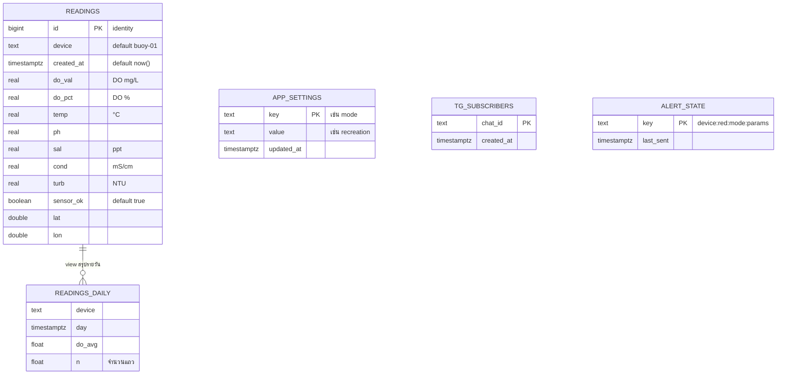
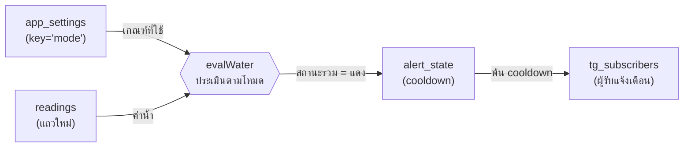

# 4. Database Schema

ฐานข้อมูลหลัก: **Supabase (PostgreSQL)** — สร้างด้วย 3 ไฟล์
| ไฟล์ | สร้างอะไร |
|---|---|
| `3-supabase-primary/schema.sql` | ตาราง `readings` + index + RLS + realtime + view `readings_daily` |
| `supabase/schema-settings.sql` | ตาราง `app_settings` + RLS + realtime |
| `supabase/schema-telegram.sql` | ตาราง `tg_subscribers`, `alert_state` + RLS |

## 4.1 ER Diagram

## 4.2 คำอธิบายตาราง

### `readings` — ค่าที่ทุ่นส่ง (1 แถว = 1 รอบการวัด ทุก 15 วินาที)
| คอลัมน์ | ชนิด | ค่าเริ่มต้น / ข้อกำหนด | ความหมาย |
|---|---|---|---|
| `id` | bigint | identity, **PK** | ลำดับแถว |
| `device` | text | not null, `'buoy-01'` | รหัสทุ่น (รองรับหลายทุ่น) |
| `created_at` | timestamptz | not null, `now()` | เวลาที่บันทึก (ฐานข้อมูลใส่ให้ ทุ่นไม่ต้องส่ง) |
| `do_val` | real | | ออกซิเจนละลายน้ำ (mg/L) — ใช้ชื่อ `do_val` เพราะ `do` เป็นคำสงวนของ SQL |
| `do_pct` | real | | ออกซิเจนอิ่มตัว (%) — เซนเซอร์อาจส่งเป็นสัดส่วน (0.90) |
| `temp` | real | | อุณหภูมิ (°C) |
| `ph` | real | | pH |
| `sal` | real | | ความเค็ม (ppt) |
| `cond` | real | | การนำไฟฟ้า (mS/cm) |
| `turb` | real | | ความขุ่น (NTU) |
| `sensor_ok` | boolean | not null, `true` | `false` = แถว heartbeat (ESP ทำงาน แต่อ่านเซนเซอร์ไม่ได้ ค่าน้ำเป็น null) |
| `lat`, `lon` | double precision | | พิกัด GPS (null = ยังจับพิกัดไม่ได้) |

### `app_settings` — ค่าตั้งของระบบ
| คอลัมน์ | ชนิด | ความหมาย |
|---|---|---|
| `key` | text **PK** | ชื่อค่า — ปัจจุบันใช้ `mode` |
| `value` | text not null | ค่า — โหมดมาตรฐาน: `conservation` / `coral` / `aquaculture` / `recreation` (ค่าเริ่มต้น) / `industrial` / `community` |
| `updated_at` | timestamptz | เวลาที่เปลี่ยนล่าสุด |

### `tg_subscribers` — ผู้รับแจ้งเตือน Telegram
| คอลัมน์ | ชนิด | ความหมาย |
|---|---|---|
| `chat_id` | text **PK** | chat id ของผู้ที่กด `/start` (เก็บเป็น text รองรับ id กลุ่มที่ติดลบ) |
| `created_at` | timestamptz | เวลาที่สมัคร |

### `alert_state` — กันแจ้งเตือนซ้ำ (cooldown)
| คอลัมน์ | ชนิด | ความหมาย |
|---|---|---|
| `key` | text **PK** | ชุดปัญหา เช่น `buoy-01:red:recreation:do_val` (ทุ่น : สถานะ : โหมด : ค่าที่ตก) |
| `last_sent` | timestamptz | เวลาที่เตือนครั้งล่าสุด — เตือนซ้ำได้เมื่อเกิน 30 นาที |

### `readings_daily` (VIEW) — ค่าเฉลี่ยรายวัน
`device, day, do_avg, do_pct_avg, temp_avg, ph_avg, sal_avg, cond_avg, turb_avg, n` · จัดกลุ่มตาม `device` และวัน · เรียงวันล่าสุดก่อน

## 4.3 ความสัมพันธ์ระหว่างตาราง
ตาราง**ไม่ได้ผูกกันด้วย Foreign Key** โดยเจตนา เพราะแต่ละตารางมีหน้าที่แยกกัน (`readings` เป็นบันทึกต่อเนื่องแบบ time-series ส่วนอีก 3 ตารางเป็นค่าตั้ง/สถานะ) การไม่ผูก FK ทำให้การเขียนข้อมูลจากทุ่นเร็วและไม่ล้มเพราะตารางอื่น
ความสัมพันธ์จริงอยู่ที่ระดับโปรแกรม (logical):

- `readings.device` ใช้แยกทุ่น (เตรียมไว้สำหรับหลายทุ่น)
- `app_settings.mode` เป็นโหมดกลาง ใช้ประเมินทุกแถว
- `alert_state.key` สร้างจาก `device` + `mode` + ชื่อค่าที่ตก

## 4.4 Indexes
| ตาราง | index | ชนิด | เหตุผล |
|---|---|---|---|
| `readings` | `readings_pkey (id)` | PK | อ้างอิงแถว |
| `readings` | **`idx_readings_device_time (device, created_at desc)`** | btree | query หลักของระบบคือ "ค่าล่าสุด/ย้อนหลังของทุ่นหนึ่ง" (`where device=? order by created_at desc limit n`) — index นี้ทำให้ไม่ต้องสแกนทั้งตาราง แม้มีข้อมูลหลายล้านแถว |
| `app_settings` | `app_settings_pkey (key)` | PK | ค้นด้วยชื่อค่า |
| `tg_subscribers` | `tg_subscribers_pkey (chat_id)` | PK | กันสมัครซ้ำ (`/start` ซ้ำไม่เพิ่มแถว) |
| `alert_state` | `alert_state_pkey (key)` | PK | ค้น/upsert สถานะ cooldown |

## 4.5 สิทธิ์การเข้าถึง (Row Level Security)
| ตาราง | anon (ทุ่น / เว็บ) | service_role (Edge Functions) |
|---|---|---|
| `readings` | **insert** + **select** (policy `anon can insert readings`, `anon can read readings`) | ทุกอย่าง |
| `app_settings` | **select** เท่านั้น (ถอนสิทธิ์ update) | ทุกอย่าง — เปลี่ยนโหมดได้ทางฟังก์ชัน `admin` และ `telegram-bot` เท่านั้น |
| `tg_subscribers` | ❌ (เปิด RLS แต่ไม่มี policy) | ทุกอย่าง |
| `alert_state` | ❌ (เปิด RLS แต่ไม่มี policy) | ทุกอย่าง |

**Realtime:** เปิด publication `supabase_realtime` ให้ `readings` และ `app_settings`

## 4.6 ข้อมูลสำคัญอื่น
- **ปริมาณข้อมูล:** ทุ่น 1 ตัว ≈ 5,760 แถว/วัน (ทุก 15 วินาที) ≈ 2.1 ล้านแถว/ปี
- **ค่าที่ไม่เก็บ:** TDS (เซนเซอร์คำนวณจาก EC: TDS = EC µS/cm × 0.64 จึงไม่มีข้อมูลเพิ่ม)
- **การเปลี่ยนโครงสร้าง:** ถ้าลบคอลัมน์ที่ firmware ยังส่งอยู่ Supabase จะปฏิเสธทั้งแถว (HTTP 400) — ต้อง flash firmware ให้เลิกส่งก่อนเสมอ และถ้ามี view อ้างถึงคอลัมน์ต้อง drop/สร้าง view ใหม่
- **แผนสำรอง MySQL** (`4-server-backup/db.sql`): ตารางเดียวกัน ต่างที่ชื่อคอลัมน์เวลาเป็น `ts` และ `app_settings`/`alert_state` ใช้คอลัมน์ `k`/`v` · index `idx_ts (ts)`, `idx_device_ts (device, ts)`
